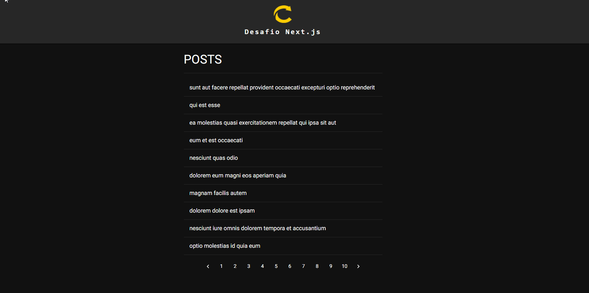

## Imersão 17 Full Cycle - Desafio 02 - Next.js

### Objetivo

Criar uma aplicação que consome uma [API](https://jsonplaceholder.typicode.com/posts) e liste os dados obtidos, bem como uma página com os detalhes dos posts.

**Demo:**

---

## Requisitos

1 - Utilizar Next.js;

2 - Utilizar Material UI;

3 - Tentar utilizar SSR o máximo possível;
